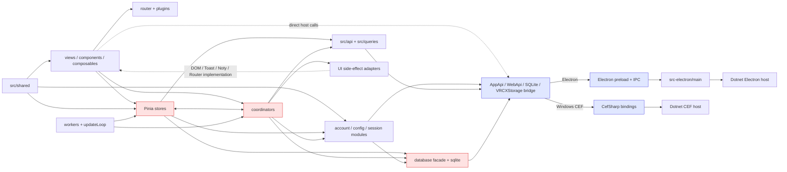

# VRCX-Luo 架构诊断报告

> 分析范围：当前工作树中的 Vue 3、Pinia、Electron、CEF/C#、数据库模块、测试和项目文档。本文记录诊断结论和实施状态；updateLoop 第一刀、M-01.1 剪贴板 capability、M-01.2a/2b 文件与目录选择 capability、M-01.3 Dotnet bridge allowlist、B-01 宿主桥安全封口、M-03 编排层适配器及 callable interface 修复、M-06 Notification Store 低风险 seam、M-08 API/Query 缓存 seam、M-09 Group/Favorite/User 纯 module 切片、M-07.1～M-07.6 Electron composition-root seam、M-00.1～M-00.3 测试/CI 门禁、N-02 版本来源与一致性门禁，以及 N-03 Shared/Localization 依赖和语言包门禁已落地，其余内容仍是只读建议。

> 实施状态（2026-09-05）：`updateLoop` 调度器、独立任务 module、M-01.1 的 CEF/Electron 剪贴板 capability、M-01.2a/2b 的 CEF/Electron 文件与目录选择 capability、M-01.3 的 Dotnet bridge class/method allowlist 与 args envelope 校验、B-01 的可信渲染来源 guard 与 174 个方法参数 schema、M-03 的 UI adapter 与 callable Toast interface、M-06 的通知 projection/persistence/seen queue module、M-08 的 Query cache/resource registry seam、M-09.1～M-09.8 的 Group/Favorite/User 纯决策与 projection module、M-07.1～M-07.6 的 Electron .NET bootstrap/IPC 注册/双宿主 capability contract/窗口状态/窗口事件/窗口关闭守卫 Adapter、M-00.1～M-00.3 的 JavaScript 类型收敛/重构 smoke/分阶段 CI 门禁、N-02 的共享版本元数据/package-lock 同步/一致性校验，以及 N-03 的 Shared/Localization 依赖方向 guard/语言包 contract/CI 聚合门禁均已落地；coordinator/store 公共 interface 保持不变，`main.js` 的 tray/notification 实现仍未迁移，多账户运行时功能仍按要求暂停。

## 结论摘要

项目当前是一个“多套编排中心并存”的混合架构：Pinia store、coordinator、database facade 和宿主 bridge 都在承担部分业务编排。功能覆盖广，但模块边界较浅，主要风险集中在跨层调用、双宿主桥接、账号上下文、上帝模块和质量门禁。

- `src/components` 约 537 个文件、5.3 万行；`src/views` 约 225 个文件、5.1 万行。
- `src/stores` 64 个文件、约 2.8 万行；`src/coordinators` 31 个文件、约 0.8 万行。
- 约 17 个 store 依赖 coordinator，约 20 个 coordinator 反向依赖 store。
- 约 54 个生产文件直接依赖数据库模块，约 52 个生产文件直接访问 `AppApi`、`VRCXStorage`、`LogWatcher` 等宿主全局对象。
- B-01 已封口动态 .NET/IPC bridge 的来源与参数边界；当前没有确认必须停版的无条件 Blocker。若新增 renderer document、开发端口或宿主方法，必须先更新策略/manifest 与回归测试。

严重程度含义：

- **Blocker**：会阻断安全发布、造成高概率数据损坏，或存在明确的高危运行时路径。
- **Major**：高耦合、高回归概率或明显影响维护效率/正确性。
- **Minor**：文档、规范、局部可维护性问题，不立即阻断功能。

## 1. 按目录诊断

| 目录/模块 | 主要职责 | 当前潜在问题 |
|---|---|---|
| `src/views` | 页面级功能、路由页面、业务流程组合 | 页面直接读写 store、数据库和宿主 API；查询、事件监听、窗口控制混在页面；存在多个 900～1300 行页面 |
| `src/components` | 对话框、列表、卡片、表格等可复用 UI | 复用组件大量依赖全局 store、router、toast、DOM；不少组件实际承担完整业务流程 |
| `src/stores` | Pinia 状态、派生数据、部分业务命令 | 同时访问 API、数据库、Electron、DOM 和 coordinator；通知 store 已通过 M-06 建立 projection/persistence/queue module，但兼容 facade 仍较大，其他上帝 store 与循环依赖仍在 |
| `src/services` | 数据库、账号会话、配置、SQLite、聚合视图 | database facade 过宽；`dbVars` 是可变全局上下文；数据模块反向依赖 UI；M-01.1/M-01.2a/2b 已新增 clipboard/file/directory capability，宿主 bridge 的来源/参数门禁已由 B-01 收口 |
| `src/coordinators` | WebSocket/API/数据库事件编排 | store/API/database 耦合仍在；M-03 已把 UI implementation 收敛到 services adapter seam，M-09 已把 Group/Favorite/User 的角色、presence、持久化、收藏、本地化和自动状态决策深化为纯 module，后续继续拆 use-case |
| `src/api` | REST/API endpoint 请求封装 | `window.request` 全局暴露；M-08 后缓存副作用经 `queryCache` adapter，Query resource 仍由 facade 组装，宿主全局和 API/Query 边界仍需后续收窄 |
| `src/queries` | Query key、实体缓存、查询策略、resource registry | M-08 已集中 QueryClient side effect、scope key 和 resource registry；Pinia 与 Query 的实体数据所有权仍需继续明确 |
| `src/shared` | 常量、工具函数、基础 UI 操作 | 目录仍包含 UI、store、API 和 service 历史职责；N-03 已建立依赖方向 guard，当前 14 条遗留反向边显式登记并可见，新增反向边会阻断 |
| `src/composables` | 可复用的 Composition 行为 | 总体边界较合理，但生命周期和 worker 相关测试警告较多 |
| `src/plugins` | i18n、router、组件、Sentry、interop 初始化 | 初始化顺序复杂；router 存在静态和动态混合导入，构建有 chunk 警告 |
| `src/ipc-electron` | Renderer 到 Electron 的 IPC 代理 | M-01.3 保留动态 Proxy 兼容 facade；preload/main/InteropApi 共享 manifest 参数校验，main 的全部 15 个 IPC handler 另经可信来源 guard |
| `src-electron` | 主进程、窗口、托盘、IPC、C# 启动 | `main.js` 约 1058 行，托盘、通知和生命周期仍集中；M-07.1 已把 10 个同步 .NET 初始化调用移入 `dotnetBootstrap.cjs`，M-07.2 已把 IPC channel 注册移入 `ipcHandlers.cjs`，M-07.3 已固化双宿主 capability contract，M-07.4～M-07.6 已移出窗口状态、窗口事件和关闭守卫，B-01 新增 renderer source policy 与统一 IPC guard |
| `Dotnet` | CEF/Electron C# 宿主、SQLite、日志、VR overlay | CEF/Electron 两套项目目标框架和依赖版本存在漂移；部分 C# 类过大 |
| `Dotnet.Tests` | C# WinForms 测试项目 | 已接入 xUnit、正式测试发现和 Windows CI job；测试通过 STA 辅助器执行 |
| `src/vr` | VR overlay 和 VR 页面 | `Vr.vue` 超过 2000 行，VR UI、状态和平台行为混杂 |
| `src/workers` | 后台任务和定时 worker | 异步边界较隐蔽，独立测试接缝不足 |
| `src/localization` | 多语言 JSON 和翻译辅助 | N-03 已增加以 `en.json` 为 canonical 的结构/key 检查；非英文缺失和额外 key 仍按 fallback/漂移报告，不自动改写译文 |
| `Installer`、`build-scripts` | 安装包、构建、发布脚本 | Windows shell 假设较多；N-02 已将 JS 构建脚本接入共享版本 reader 和 `check:version` 门禁，CEF job 仍按环境生成 `Installer/version_define.nsh` |
| `.github/workflows` | CI、构建和发布 | 已支持 PR 与手动触发；`quality_js`、Shared/Localization 架构检查和 C# 测试为阻断门禁，全量测试、lint/format 保留可见 report-only 基线 |

## 2. 文档盘点

| 文档 | 覆盖内容 | 诊断 |
|---|---|---|
| `README.md` | 产品、功能、安装、构建和安全提醒 | 适合入门，但缺少稳定的模块边界和运行时数据流契约 |
| `docs/JIRAI_FEATURES.md` | Luo 相对上游的功能清单 | 行数和状态信息已过时；多账号状态与当前代码不完全一致 |
| `docs/DATA_REFRESH.md` | 日志、WebSocket、5 分钟轮询、1 小时同步 | 主体模型清楚，但未充分描述多账号聚合、失败重试和切换行为 |
| `docs/DATABASE_SCHEMA.md` | 核心数据库表和关系 | 只有少量核心表，遗漏 activity、通知、tracked nonfriends、manual relations、缓存等实际模块 |
| `docs/MULTI_ACCOUNT_V4_DETAIL_DESIGN.md` | 多账号、DB prefix、WebSocket、热切换、聚合视图 | 仍是 Draft；设计与当前实现存在契约漂移 |
| `docs/CEF_LOCAL_TESTING.md` | Windows CEF 本地测试和安全重启 | 运维内容较实用，但没有完整覆盖 Electron/CEF 差异 |
| `docs/BIO_DIFF_ENGLISH_PUNCTUATION_BUG.md` | Bio Diff 缺陷记录 | 缺少可重复的回归测试矩阵 |
| `docs/schemas/screenshotMetadata-schema.json` | 截图元数据 JSON Schema | 已恢复为可解析 JSON，并由 `npm run check:schema` 和 CI 校验；后续可补充字段语义校验 |
| `docs/third-party-libs.md`、`docs/DEPENDENCY_VERSION_MATRIX.md` | Dotnet/前端第三方依赖来源与版本 | N-04.1 已建立只读版本矩阵；跨宿主漂移仍需平台验证，许可证与安全审计信息继续按来源补齐 |
| `CONTEXT.md`、`docs/adr/` | 领域词汇和架构决策 | N-01 已建立领域上下文与 4 条 ADR；后续重构应先对照不变量和暂缓范围 |

## 3. 跨层耦合和问题清单

| 文件路径 | 问题类型 | 严重程度 | 建议 |
|---|---|---:|---|
| `src/stores` ↔ `src/coordinators` | 双向依赖、编排循环 | Major | 先选 friend/favorite 一条链路，引入 use-case 或事件 port；store 消费结果，coordinator 负责编排 |
| `src/coordinators/userCoordinator.js` | 原先拼接关系建议 HTML、`querySelector`、注册 DOM 事件；自动状态和配置 projection 也混在 coordinator | Major → 已完成 M-03.4/M-09.7/M-09.8 | 关系建议已通过 `relationSuggestionNotification` adapter；语言 projection 和自动状态决策已通过纯 module；后续仍可继续拆 user use-case 与 notification domain |
| `src/coordinators/imageUploadCoordinator.js` | 原先直接查找 input，同时调用 Toast、AppApi、Web API | Major → 已完成 M-03.1 | input 查询已通过 `domInputAdapter` seam；后续再收窄上传 capability 和错误返回 |
| `src/services/toastAdapter.js` ↔ `src/coordinators/gameCoordinator.js` | adapter 原先只有 method object，旧协调器仍调用 `toast(message)`，生产包触发 `TypeError: Us is not a function` | Major → 已完成 M-03.6 | adapter 现在同时暴露 callable function 与 method interface；回归测试覆盖默认调用形状，提交 `3d0bf3c3` |
| `src/coordinators/authCoordinator.js` | 原先直接创建登出 Noty 并执行 router 跳转 | Major → 已完成 M-03.3/M-03.5 | Router 和登出欢迎通知均经 adapter；保留旧 `runLogoutFlow` interface |
| `src/coordinators/groupCoordinator.js` | 原先在 Group 更新流程内计算角色/presence/持久化/语言 projection 并发送通知 | Major → 已完成 M-09.1～M-09.4 | 角色、语言、presence 和持久化均已提取为纯 module；保留 `applyGroup`、`applyPresenceGroups` 和通知顺序 |
| `src/coordinators/favoriteCoordinator.js` | 本地 world/avatar/friend 收藏分组、缓存、API、数据库和 Toast 混合 | Major → 已完成 M-09.5/M-09.6 | 本地实体和好友 id projection 已集中到 `favoriteLocalProjection`；后续再拆事件/持久化 use-case |
| `src/stores/ui.js` | store 同时管理状态、router、DOM drop 事件、开发者工具和窗口行为 | Major | 拆成 UI state 与 window actions；平台操作通过 adapter |
| `src/stores/search.js` | `directAccessPaste` 同时选择 Electron/CEF 剪贴板桥和解析流程 | Major → 已完成 M-01.1 | 剪贴板读取已移入 `clipboardAdapter`；保留 `directAccessPaste()` 兼容入口，后续再拆 direct-access use-case |
| `src/stores/settings/notifications.js` | `selectCustomNotificationSound` 同时选择 Electron/CEF 文件桥并持久化设置 | Major → 已完成 M-01.2a | 文件选择已移入 `fileDialogAdapter`；保留取消值和设置 Store 公共接口 |
| `src/stores/settings/advanced.js` | `folderSelectorDialog` 同时选择 Electron/CEF 目录桥，并维护并发可见状态 | Major → 已完成 M-01.2b | 目录选择已移入 `fileDialogAdapter`；保留旧路径提示、取消值、可见状态守卫和设置 Store 公共 interface |
| `src/stores/settings/appearance.js` | store 直接修改 `document.documentElement`，并访问 API/数据库 | Major | 提取主题 adapter/composable；store 只保存偏好和派生状态 |
| `src/stores/notification/index.js` | 通知状态、数据库、API、托盘、Electron、router、dialog、Toast 混合 | Major → 已完成 M-06.1～M-06.4 低风险 seam | 已提取通知领域 projection、偏好 persistence、seen queue；保留旧 action 兼容入口和 tray adapter。后续更深拆分等待 M-01/M-04 capability 契约 |
| `src/services/sqlite.js` | 数据模块反向依赖 modal、i18n、外链打开 | Major | SQLite 层只抛结构化错误；由上层负责提示、翻译和导航 |
| `src/services/accountSession.js` | 会话、登录/2FA、好友缓存、WebSocket、定时器、原始 SQL、modal 混合 | Major | 分离 session transport、认证用例、缓存持久化和调度器 |
| `src/services/database/index.js` | facade 过宽，`window.database` 全局暴露，`dbVars` 可变 | Major | 按领域拆 database module；引入显式 `DbContext`；保留兼容 facade |
| `src/services/database/gameLog.js` | 约 2200 行，写入、查询、媒体解析、聚合、统计全混在一起 | Major | 先拆只读查询，再拆写入和 parser，避免一次性重写 SQL |
| `src/services/aggregatedView.js` | 使用 `accountHub.allSessions` / `primaryPrefix`，但对应 getter 不存在 | Major | 定义明确的账号元数据 interface，并为标签、颜色和 primary 判断增加契约测试 |
| `src/api/index.js`、`src/queries` | API、Query cache、Pinia 可能重复持有实体数据 | Major → 已完成 M-08.1～M-08.3 | Query side effect、scope key 和 resource registry 已统一到 Query layer；继续明确 Pinia/Query 的实体唯一来源，并收窄全局 request facade |
| `src/stores/updateLoop.js` | 兼容入口和依赖组装仍集中；任务实现已移到独立模块 | Major | 已完成第一刀；后续可把宿主 capability 注入进一步收窄，继续保留兼容 facade |
| `src-electron/preload.js`、`src-electron/main.js`、`src-electron/InteropApi.js`、`src/ipc-electron/interopApi.js` | 动态 class/method IPC 曾缺少 allowlist、参数 envelope 和可信来源边界 | Major → 已完成 M-01.3/B-01 | 共享 `dotnetCapabilityManifest.cjs` 收敛允许的 class/method 与 174 个方法 schema；main 的 15 个 IPC handler 通过 `rendererSourcePolicy.cjs` 拒绝非信任 document，renderer Proxy 保留兼容 facade |
| `src-electron/main.js` | 主进程约 1058 行，窗口、托盘、通知、IPC、Dotnet 启动集中 | Major → M-07.1～M-07.6 首批 seam 完成 | Dotnet 启动、IPC 注册、窗口状态读取/动作、窗口事件和关闭守卫已移出，双宿主 contract 已可执行；tray、notification 行为实现仍可独立拆分 |
| `Dotnet/VRCX-Cef.csproj`、`Dotnet/VRCX-Electron*.csproj` | CEF/Electron 目标框架和依赖版本漂移 | Major → N-04.1 已建立观测 | 版本矩阵阻断结构性错误并报告 NLog、SQLite、System.Management、NodeApi 等平台漂移；升级仍需单独验证 |
| `src` 多处生产文件 | 大量文件直接绕过边界访问 database 或宿主全局对象 | Major | 用 lint boundary 限制跨层 import，逐步迁移到 use-case/adapter |
| `.github/workflows/ci.yaml`、`package.json` | CI 已由 PR/手动触发；类型检查和重构 smoke 已纳入阻断门禁，全量测试与 lint/format 仍有历史红线 | Major → M-00.1～M-00.3 已完成 | 保持 report-only 结果可见并逐类收敛遗留债务；后续再收紧全量 test、lint、format |
| `src/**/*.test.*` | 当前前端测试有大量失败和脆弱 mock | Major | 先修公共组件、图标、数据库 contract mock，再增加新测试 |
| `Dotnet.Tests/VRCX.Cef.Tests.csproj` | C# 测试发现曾被 `OutputType=Exe` 绕过 | Major | 已改为正式测试项目，`dotnet test` 当前发现并通过 3 个测试，且由 Windows CI job 执行 |
| `docs/schemas/screenshotMetadata-schema.json` | Schema 结构校验此前缺失 | Major | 已增加 `check:schema` 脚本并接入 CI，后续补字段语义/样例校验 |
| `docs/DATABASE_SCHEMA.md`、`docs/JIRAI_FEATURES.md` | 文档与代码状态、表结构、行数不一致 | Minor | 描述稳定契约；易变的统计信息改为脚本生成 |
| `package.json`、`Version` | 版本号来源不一致 | Minor → N-02 已完成 | 根 `Version` 作为唯一人工来源；package/lock 同步和 `check:version` 构建前门禁已建立，Electron/Vite/产物命名共用解析契约；Installer 版本仍由 CEF job 注入 |

## 4. 上帝组件和上帝 store

`300 行`只是信号；以下文件同时包含状态、IO、UI 副作用或跨域编排，属于高置信度上帝模块。

| 类型 | 文件（当前约行数） | 责任叠加 | 首个拆分边界 |
|---|---|---|---|
| Store | `src/stores/notification/index.js`（约 1990） | 通知状态、API、数据库、托盘、路由、dialog、Toast；projection、偏好 persistence、seen queue 已提取 | notification command facade / database capability |
| Store | `src/stores/photon.js`（1831） | Photon 事件、实例状态、网络同步、数据库 | Photon transport / instance projection |
| Store | `src/stores/instance.js`（1411） | 实例模型、加入/离开、API、平台动作 | instance state / join-leave use-case |
| Store | `src/stores/friend.js`（1385） | 好友、在线状态、排序、数据库、账号聚合 | friend entity / presence / aggregation |
| Store | `src/stores/gameLog/index.js`（1236） | 日志、worker、媒体、数据库、统计 | ingestion / query / parser |
| Store | `src/stores/settings/appearance.js`（1235） | 设置、主题 DOM、文化设置、API、数据库 | preference state / theme adapter |
| Store | `src/stores/settings/advanced.js`（1130） | 系统设置、文件操作、HTTP、清理、Toast | settings state / system actions |
| Store | `src/stores/auth.js`（1039） | 登录、token、账号切换、自动登录、宿主调用 | auth state / auth use-case / account context |
| Store | `src/stores/vrcx.js`（871） | 应用启动、迁移、配置、更新、数据库修复 | app lifecycle / migration |
| Coordinator | `src/coordinators/userCoordinator.js`（1297） | 用户事件、好友关系、DOM 通知、store 修改、API；语言和自动状态决策已提取 | user event / relationship use-case / notification（纯 projection/decision module 已落地） |
| Coordinator | `src/coordinators/favoriteCoordinator.js`（1185） | 收藏事件、API、数据库、store、Toast；本地收藏 projection 已提取 | favorite event / persistence（local projection module 已落地） |
| Coordinator | `src/coordinators/groupCoordinator.js`（981） | Group API、事件、缓存、store、UI 提示；角色、语言、presence、持久化已提取 | group sync / group commands（纯决策与 projection module 已落地） |
| Component | `src/vr/Vr.vue`（2175） | VR 页面、状态、输入、窗口、平台交互 | VR shell / panels / commands |
| Component | `src/views/Charts/components/MutualFriends.vue`（1351） | 查询、图表转换、筛选、展示 | data query / chart model / view |
| Component | `src/views/Tools/Gallery.vue`（1312） | 图片加载、缓存、筛选、窗口和操作 | gallery data / selection / presentation |
| Component | `src/components/dialogs/GroupDialog/GroupDialog.vue`（1269） | Group 查询、编辑、成员、日历、操作 | group data / dialog shell |
| Component | `src/views/Favorites/FavoritesAvatar.vue`（1208） | 收藏数据、拖拽、排序、操作、展示 | favorite query / reorder command |
| Component | `src/components/StatusBar.vue`（1113） | 状态展示、账号、更新、托盘、平台操作 | status projection / actions |
| Host | `src-electron/main.js`（1182） | Electron 生命周期、窗口、托盘、IPC、Dotnet | window manager / tray / IPC / host lifecycle |

生成的 `Dotnet/Overlay/OpenVR/openvr_api.cs` 虽超过 8000 行，但属于生成/第三方接口文件，不应作为第一批重构目标。

## 5. 模块依赖关系

红色模块和双向边表示当前主要风险：store/coordinator 双向依赖、database facade 过宽、宿主 bridge 暴露面过大。

## 6. 最安全的 3 个重构切入点

### 前置安全网

在动业务代码前，先让 `typecheck`、前端测试、C# 测试发现和 schema 校验可以被 CI 可靠执行。这些改动不改变运行时行为，却能显著降低后续回归风险。

### 1）拆分 `updateLoop` 调度器（已完成）

目标：`src/stores/updateLoop.js`。

- 保留现有 `updateLoop()`、启动和停止方法。
- 将当前任务拆成当前用户、好友同步、Group 实例、游戏状态、更新检查、Discord 状态等 task module。
- timer 只负责调度，不直接访问 `AppApi`、数据库和多个 store。
- 用 fake clock 测试每个任务的触发周期。
- 实际落地文件为 `src/stores/updateLoopTasks/` 下的任务模块和 `updateLoopScheduler.js`；`updateLoop.js` 只负责依赖组装、注册、启动/停止和兼容 setter。
- 除六个目标任务外，非好友同步、IPC 超时、缓存清理、自动状态和数据库优化也已独立，避免遗留业务分支继续堆回 store。

这是最安全的第一刀：不改数据库结构、路由或 UI 接口，局部性高。每个提取步骤均单独提交并验证。

### 2）为 CEF/Electron 建立宿主 capability adapter

目标：`src/plugins/interopApi.js`、`src/ipc-electron/interopApi.js`、`src-electron/preload.js`、`src-electron/main.js`。

- 定义窄的 host interface，例如窗口、文件、存储、VR、数据库能力。
- CEF 和 Electron 各自提供 implementation。
- 暂时保留旧的 `window.AppApi` 兼容 facade，逐个迁移调用方。
- 主进程对 class、method、参数做 allowlist 和 schema 校验。
- 先迁移窗口/存储能力，再迁移数据库和系统操作。
- M-01.1 已先迁移剪贴板读取：`src/services/clipboardAdapter.js` 通过显式依赖分别封装 Electron `getClipboardText` 和 CEF `AppApi.GetClipboard`；`src/stores/search.js` 只保留兼容入口，解析和提示行为未改动。
- M-01.2a 已迁移自定义通知音频文件选择：`src/services/fileDialogAdapter.js` 通过显式 options 分别封装 Electron filters 与 CEF legacy 参数；`selectCustomNotificationSound()` 继续保留 `if (!filePath)` 取消语义和持久化顺序。
- M-01.2b 已迁移目录选择：同一 capability module 通过 `createDirectoryDialogAdapter()` 封装 CEF 的旧路径 hint 与 Electron 的无参 dialog；`folderSelectorDialog()` 保留旧的可见状态 guard、错误传播和 host-specific cancellation value。
- M-01.3 已收敛动态 Dotnet bridge：`dotnetCapabilityManifest.cjs` 统一 renderer-facing class/method 清单；preload、main process 和 `InteropApi` 三层校验，renderer Proxy 仍保留旧动态 facade。B-01 在同一 manifest 上补齐 174 个方法的参数数量/基础类型 schema，并新增 `rendererSourcePolicy.cjs`；`main.js` 注册的 15 个 IPC handler 均先校验 `senderFrame.url`（兼容旧 Electron 才回退 `sender.getURL()`），仅接受 packaged `index.html`/`vr.html`，开发模式仅接受 localhost:9000 对应页面。
- M-07.1～M-07.6 已提取 Electron composition-root 首批 seam：`dotnetBootstrap.cjs` 通过显式依赖执行原有 10 个同步初始化调用；`ipcHandlers.cjs` 集中 15 个 IPC channel 注册；`hostCapabilityContract.js` 固化七类 CEF/Electron capability 的 method、参数、channel 与取消/错误语义；`windowState.cjs`、`windowEventBridge.cjs` 和 `windowCloseHandler.cjs` 分别承接窗口状态、窗口事件和关闭守卫。所有改动均保留原顺序、参数、同步/异常行为，窗口、托盘、VR overlay 与 renderer interface 未改变。

这是高 leverage 的架构接缝（seam）：新旧实现可以短期并存，不需要一次性改写业务代码。

### 3）兼容式拆分数据库 facade

目标：`src/services/database/index.js`、`src/services/database/gameLog.js`、`src/services/accountHub.js`。

- 按 feed、activity、gameLog、favorites、notifications 等领域拆出 database module。
- 用显式账号上下文替代可变全局 `dbVars`。
- 保留现有 `database.xxx()` facade，将旧方法转发到新模块。
- 第一阶段优先拆 gameLog 的只读查询，避免先动写入和事务。
- 为 prefix、事务和账号切换增加 contract test。

这里的关键是保持旧接口和新 implementation 可以并存，避免大面积改动调用方。

## 7. 已执行的验证

| 检查项 | 结果 |
|---|---|
| `npm run prod` | 成功；存在 router 动态导入警告和 Node deprecation 警告 |
| `npm test` | 当前 255 个测试文件中 24 个失败、88 个断言失败并有 3 个既有未处理异常；M-06/M-07/M-08/M-09/B-01 新增测试通过，既有失败数量未增加 |
| updateLoop/task 定向测试 | 13 个测试文件、28 个测试通过 |
| M-03 adapter 定向测试 | DOM input、Toast、Router、关系建议通知、登出欢迎通知及 coordinator 回归测试通过 |
| M-09.1 Group 决策定向测试 | 4 个测试文件、20 个测试通过 |
| M-09.2 Group 语言 projection 定向测试 | 5 个测试文件、23 个测试通过 |
| M-09.3 Group presence 决策定向测试 | 6 个测试文件、26 个测试通过 |
| M-09.4 Group 持久化 projection 定向测试 | 7 个测试文件、29 个测试通过 |
| M-09.5/M-09.6 Favorite projection 定向测试 | 2 个测试文件、6 个测试通过 |
| M-09.7 User 语言 projection 定向测试 | 3 个测试文件、33 个测试通过 |
| M-09.8 User 自动状态决策定向测试 | 5 个测试文件、40 个测试通过 |
| M-08 Query cache/resource registry 定向测试 | 12 个测试文件、63 个测试通过 |
| M-08 新增 Query module `oxlint` | 0 warning、0 error；既有 API lint debt 未扩大 |
| M-06 Notification Store 定向测试 | 5 个测试文件、30 个测试通过 |
| M-01.1 clipboard/search 定向测试 | 2 个测试文件、29 个测试通过；adapter 路由与 CEF 失败回退均覆盖 |
| M-01.2a file-dialog/notifications 定向测试 | 2 个测试文件、6 个测试通过；CEF/Electron 参数、取消值、异常传播和 Store 持久化均覆盖 |
| M-01.2b directory-dialog/Settings 回归 | 2 个测试文件、24 个测试通过；CEF 旧路径、Electron 无参调用、取消值和设置对话框行为均覆盖 |
| M-01.3 Dotnet bridge manifest | manifest 契约、参数 schema 与来源 guard 共 3 个定向测试文件、13 个测试通过；174 个方法均有 schema，主进程/renderer 语法检查和生产构建通过 |
| M-07.1～M-07.6 Electron composition root / 双宿主 contract | IPC 注册、双宿主契约、窗口状态/事件/关闭守卫定向测试通过；与 M-01 capability 回归合计 9 个文件、28 个测试通过；格式、Node 语法和生产构建通过 |
| `npm run lint` | 失败：约 45 个错误、79 个警告 |
| `npm run typecheck:js` | **通过：0 diagnostics**；210 条既有诊断已通过 M-00.2 的静态契约切片清零，未修改多账户运行时流程 |
| `npm run test:refactor` | **通过：56 个测试文件、293 项测试**；覆盖 coordinator、services、queries、notification、updateLoop task 和 B-01 bridge security 的回归 smoke |
| `dotnet test` | 已发现并通过 3 个测试；WinForms 用 STA 辅助器运行 |
| C# 测试项目构建 | 通过：0 警告、0 错误 |
| `screenshotMetadata-schema.json` | JSON 解析和 5 属性结构检查通过 |

### N-02 后置验证（2026-09-05）

| 检查项 | 结果 |
|---|---|
| 版本元数据/同步/一致性定向测试 | **通过：4 个文件、11 项测试** |
| `npm run check:version` | **通过**：`2026.08.23 -> 2026.08.23` |
| `npm run test:refactor -- --reporter=dot` | **通过：60 个文件、304 项测试** |
| `npm run typecheck:js` | **通过：0 diagnostics** |
| `npm run prod` | **通过**；保留既有 router 动态 import 与 Node deprecation 警告 |

N-02 的首次 Vite 接入尝试触发了 `typecheck:js` 的跨 tsconfig 诊断，已在同一切片内按回滚协议由 `ffcc32a6` 回滚；随后以 `271dfdca` 建立显式 CJS 类型检查边界，最终回归通过，未扩大既有失败基线。

### N-03 后置验证（2026-09-05）

| 检查项 | 结果 |
|---|---|
| Shared/Localization 依赖方向扫描 | **通过**：74 个源文件、14 条受限边，全部为已登记历史例外 |
| Localization contract | **通过**：14 个语言包、2699 个英文 canonical key；13285 个 fallback 缺失和 200 个额外 key 作为 report-only 漂移 |
| N-03 定向测试 | **通过：2 个文件、7 项测试** |
| `npm run check:architecture` | **通过**：依赖方向与语言包结构检查聚合入口 |
| `npm run test:refactor -- --reporter=dot` | **通过：62 个文件、311 项测试** |
| `npm run typecheck:js` | **通过：0 diagnostics** |
| `npm run prod` | **通过**；4408 个模块构建完成，保留既有 router 动态 import 与 Node deprecation 警告 |

N-03 只增加静态检查、测试和 CI 门禁，没有迁移现有 Shared 运行时职责，也没有自动重写语言包；后续可在独立切片中逐条消化 14 条遗留反向边和 200 个额外 key。

### 术语说明

本文的“模块（module）”指可独立维护的代码边界；“接口（interface）”是调用方依赖的稳定契约；“adapter”用于隔离不同宿主实现；“接缝（seam）”允许新旧实现并存；“高 leverage”表示一次改动能降低多个调用方的复杂度；“局部性”表示修改影响范围可控。
