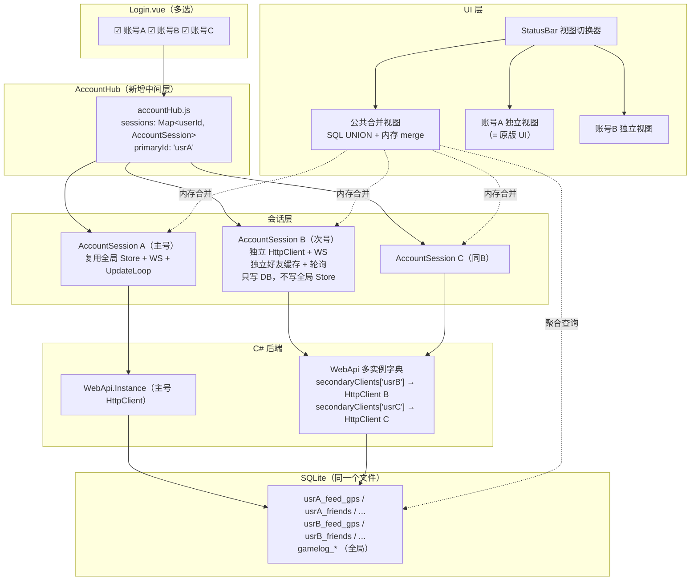

# VRCX-Jirai 多账号支持 · V4 详细设计文档

> **方案**: 单进程 · 单内存池 · 中间层拦截 (Plan B/方案三)
> **状态**: Draft
> **最后更新**: 2026-04-30

---

## 目录

1. [架构总览](#1-架构总览)
2. [C# 后端改造：多 HttpClient](#2-c-后端改造多-httpclient)
3. [前端中间层：AccountHub + AccountSession](#3-前端中间层accounthub--accountsession)
4. [数据库层：零改动 + 聚合查询](#4-数据库层零改动--聚合查询)
5. [WebSocket 多连接管理](#5-websocket-多连接管理)
6. [轮询定时器：次号的 UpdateLoop](#6-轮询定时器次号的-updateloop)
7. [聚合视图层：数据合并与覆盖](#7-聚合视图层数据合并与覆盖)
8. [视图切换：热替换 Store 上下文](#8-视图切换热替换-store-上下文)
9. [UI 改动清单](#9-ui-改动清单)
10. [全局单例依赖拓扑](#10-全局单例依赖拓扑)
11. [通知系统：合并与操作路由](#11-通知系统合并与操作路由)
12. [文件改动清单与代码量估算](#12-文件改动清单与代码量估算)
13. [开发分期](#13-开发分期)
14. [风险与缓解](#14-风险与缓解)

---

## 1. 架构总览

### 1.1 核心原则

| 原则 | 说明 |
|------|------|
| **最小侵入** | 现有 Store / Coordinator / View 的业务代码零修改或极低修改 |
| **主号复用** | 第一个登录的账号（主号）完整复用现有全局 Store 和流程 |
| **次号隔离** | 次号的会话在后台独立运行，只写数据库，不污染全局 Store 内存 |
| **聚合只读** | 公共合并视图通过 SQL UNION + 内存 merge 产生，不修改任何账号的原始数据 |
| **热替换切换** | 切到某个账号的"独立视图"时，把全局 Store 的数据快照替换为该账号的数据 |

### 1.2 架构图



### 1.3 数据流概览

| 场景 | 数据路径 |
|------|---------|
| 主号好友上线 | WS-A → `handlePipeline()` → `applyUser()` → 写全局 `friendStore` + 写 DB `usrA_feed_*` |
| 次号好友上线 | WS-B → `session.handleEvent()` → 写 `session.friendsCache` + 写 DB `usrB_feed_*`（不动全局 Store） |
| 合并视图看 Feed | `aggregatedView.queryFeed()` → SQL `UNION ALL` 查 `usrA_feed_gps` + `usrB_feed_gps` |
| 合并视图看好友列表 | `aggregatedView.mergeFriends()` → 合并所有 session 的 `friendsCache`，去重+标签 |
| 切到"账号B独立视图" | `accountHub.switchTo('usrB')` → 热替换 `dbVars.userPrefix` / `userStore.currentUser` / `friendStore.friends` |
| 看 GameLog | 直接读 `gamelog_*` 全局表，与多账号无关 |

---

## 2. C# 后端改造：多 HttpClient

### 2.1 现状分析

`WebApi.cs` 当前是全局单例模式：

```
WebApi.Instance          ← 唯一实例
  ├─ _httpClient         ← 唯一 HttpClient
  ├─ CookieContainer     ← 唯一 Cookie 容器（存 VRC auth token）
  └─ SaveCookies()       ← 保存到 SQLite `cookies` 表 key='default'
```

JS 端通过 `WebApi.Execute(options)` 调用，走的就是这个唯一的 `_httpClient`。

### 2.2 改造方案：次号客户端字典

在 `WebApi` 类中新增一个字典，为每个次号维护独立的 HttpClient + CookieContainer：

```csharp
// WebApi.cs 新增成员
private readonly Dictionary<string, (HttpClient client, CookieContainer cookies)> 
    _secondaryClients = new();

// 创建次号客户端
public void CreateSecondaryClient(string accountId)
{
    var cookies = new CookieContainer();
    var handler = new SocketsHttpHandler
    {
        CookieContainer = cookies,
        UseCookies = true,
        AutomaticDecompression = DecompressionMethods.All,
        PooledConnectionLifetime = TimeSpan.FromMinutes(5),
        MaxConnectionsPerServer = 10
    };
    if (ProxySet) { handler.Proxy = Proxy; handler.UseProxy = true; }
    var client = new HttpClient(handler);
    client.DefaultRequestHeaders.Add("User-Agent", Program.Version);
    _secondaryClients[accountId] = (client, cookies);
}

// 次号请求桥接
public async Task<Tuple<int, string>> ExecuteAs(string accountId, IDictionary<string, object> options)
{
    if (!_secondaryClients.TryGetValue(accountId, out var entry))
        throw new Exception($"No secondary client for {accountId}");
    // 复用 Execute 的逻辑，但用 entry.client 代替 _httpClient
    return await ExecuteWithClient(entry.client, options);
}

// Cookie 管理
public void SetSecondaryCookies(string accountId, string cookies) { ... }
public string GetSecondaryCookies(string accountId) { ... }
public void DestroySecondaryClient(string accountId) { ... }
```

### 2.3 JS 端桥接

`webapi.js` 新增方法，次号的请求走 `ExecuteAs`：

```javascript
// webapi.js 新增
async executeAs(accountId, options) {
    var item = await WebApi.ExecuteAs(accountId, options);
    if (item.Item1 === -1) throw item.Item2;
    return { status: item.Item1, data: item.Item2 };
}
```

### 2.4 Cookie 持久化

次号的 Cookie 保存在 SQLite `cookies` 表，key 用 `secondary:{accountId}`：

```
cookies 表:
  key='default'              → 主号 Cookie
  key='secondary:usr_xxxx'   → 次号B Cookie
  key='secondary:usr_yyyy'   → 次号C Cookie
```

### 2.5 改动量估算

| 文件 | 改动 | 行数 |
|------|------|------|
| `Dotnet/WebApi.cs` | 新增字典 + `CreateSecondaryClient` + `ExecuteAs` + `SetSecondaryCookies` + Cookie 持久化 | ~80 行新增 |
| `src/services/webapi.js` | 新增 `executeAs()` / `createSecondaryClient()` / `setSecondaryCookies()` | ~20 行新增 |

---

## 3. 前端中间层：AccountHub + AccountSession

### 3.1 AccountHub（总调度器）

新增文件 `src/services/accountHub.js`，职责：管理所有会话的生命周期。

```javascript
// accountHub.js 核心 API
import { reactive, computed } from 'vue';

const state = reactive({
    sessions: new Map(),    // Map<userId, AccountSession>
    primaryId: '',          // 主号 userId
    viewMode: 'merged',     // 'merged' | 'account:usr_xxxx'
});

export const accountHub = {
    get sessions() { return state.sessions; },
    get primaryId() { return state.primaryId; },
    get viewMode() { return state.viewMode; },
    get activeSessions() { return [...state.sessions.values()]; },
    get allUserPrefixes() {
        return this.activeSessions.map(s => s.userPrefix);
    },
    isPrimary(userId) { return userId === state.primaryId; },

    // 登录多个账号（Login.vue 调用）
    async loginAll(selectedAccounts) { ... },

    // 添加次号会话
    async addSession(userId, credentials) { ... },

    // 切换视图模式
    switchToMerged() { ... },
    switchToAccount(userId) { ... },

    // 全部登出
    async logoutAll() { ... },

    // 获取指定账号的 request 函数
    getRequestFn(userId) { ... },
};
```

### 3.2 AccountSession（单账号会话）

新增文件 `src/services/accountSession.js`，每个次号一个实例。

```javascript
class AccountSession {
    constructor(userId, userPrefix) {
        this.userId = userId;
        this.userPrefix = userPrefix;          // 如 'usrxxxx'
        this.userInfo = null;                  // 当前用户的 API 返回数据
        this.friendsCache = reactive(new Map()); // Map<friendId, friendRef>
        this.wsConnection = null;              // WebSocket 实例
        this.pollTimer = null;                 // 轮询定时器
        this.stateSnapshot = null;             // 热替换时暂存的 Store 快照
    }

    // 登录流程
    async login(credentials) {
        // 1. 调 webApiService.createSecondaryClient(this.userId)
        // 2. 恢复 Cookie / 重新登录
        // 3. 获取 auth/user → this.userInfo
        // 4. 初始化用户表 database.initUserTables(this.userId)
        // 5. 连接 WebSocket
        // 6. 启动轮询
    }

    // 次号的 API 请求函数
    async request(endpoint, options) {
        const init = buildRequestInit(endpoint, options);
        return webApiService.executeAs(this.userId, init);
    }

    // WebSocket 事件处理（核心：写 DB + 写自己缓存，不动全局 Store）
    handleWsEvent(event) { ... }

    // 销毁
    destroy() { ... }
}
```

### 3.3 次号哪些全局数据可以写？

这是一个关键设计决策。有些全局缓存是按 `userId` 做 key 的，次号往里面写不会冲突：

| 全局数据 | 次号可写？ | 理由 |
|---------|-----------|------|
| `userStore.cachedUsers` | ✅ **可写** | 按 `userId` 做 key 的 Map，次号写入自己好友的玩家资料（名字、头像等）不会覆盖主号的数据，反而能让合并视图直接复用 |
| `instanceStore.cachedInstances` | ✅ **可写** | 按 `instanceTag` 做 key，实例信息是全局共享的 |
| `cache_avatar` / `cache_world` 表 | ✅ **可写** | 全局公共表（`pub`），头像/世界缓存不区分账号 |
| `friendStore.friends` | ❌ **不可写** | 这个 Map 驱动侧边栏好友列表的渲染，次号的好友混进去会导致主号视图错乱 |
| `feedStore` 内存数组 | ❌ **不可写** | Feed 页面直接绑定这个数组，混入会导致数据错乱 |
| `watchState.isLoggedIn` | ❌ **不可写** | 全局登录状态，主号控制 |
| `dbVars.userPrefix` | ❌ **不可写** | 全局表名前缀，次号必须用自己的 request 函数传入独立的 prefix |

---

## 4. 数据库层：零改动 + 聚合查询

### 4.1 现有隔离机制（零改动）

`database/index.js` 的 `initUserTables(userId)` 已经按 `userPrefix` 创建表：

```
usrA_feed_gps / usrA_feed_status / usrA_friend_log_history / ...
usrB_feed_gps / usrB_feed_status / usrB_friend_log_history / ...
gamelog_location / gamelog_join_leave / ...  ← 全局，无前缀
```

次号登录时只需调用 `database.initUserTables(secondaryUserId)` 创建对应的表。
**`dbVars` 全局变量不修改**——它始终指向主号的 prefix。次号的 DB 操作通过直接拼 SQL（传入自己的 `userPrefix`）来执行。

### 4.2 聚合查询：多 prefix UNION ALL

在 `feed.js` 的 `lookupFeedDatabase()` 中，它已经在用 UNION ALL 合并不同 feed 类型的表。
我们需要扩展它，支持传入多个 `userPrefix`：

```javascript
// feed.js 改动示例
export function buildAggregatedFeedQuery(userPrefixes, filters, limit) {
    const subQueries = [];
    for (const prefix of userPrefixes) {
        // 为每个 prefix 生成一组 UNION ALL 子查询
        subQueries.push(`SELECT *, '${prefix}' as _account FROM ${prefix}_feed_gps ...`);
        subQueries.push(`SELECT *, '${prefix}' as _account FROM ${prefix}_feed_status ...`);
        // ...其他 feed 表
    }
    return `SELECT * FROM (${subQueries.join(' UNION ALL ')}) ORDER BY created_at DESC LIMIT ${limit}`;
}
```

注意：每行结果会携带 `_account` 字段标记来源，UI 可据此显示账号标签。

### 4.3 全局表（无需聚合）

| 表 | 作用域 | 多账号处理 |
|----|--------|----------|
| `gamelog_*` | 全局 | 直接读，无需改 |
| `cache_avatar` / `cache_world` | 全局 | 直接读写，无需改 |
| `memos` / `world_memos` / `avatar_memos` | 全局 | 直接读写，无需改 |
| `favorite_*` | 全局 | ⚠️ 当前是主号的收藏夹。次号的收藏夹只存在 API 缓存中 |

---

## 5. WebSocket 多连接管理

### 5.1 现状

`websocket.js` 维护全局变量 `let webSocket = null`。收到消息后调用 `handlePipeline()` → `applyUser()` 等 coordinator 函数，这些函数会写全局 Store。

### 5.2 次号 WS 方案

次号的 WS 连接在 `AccountSession` 内部管理，**不复用** `websocket.js`：

```javascript
// AccountSession 内部
async connectWebSocket() {
    // 1. 用次号的 request 函数获取 auth token
    const json = await this.request('auth', { method: 'GET' });
    const parsed = JSON.parse(json.data);
    if (!parsed.ok) return;
    
    // 2. 建立独立的 WebSocket
    this.wsConnection = new WebSocket(`wss://pipeline.vrchat.cloud/?auth=${parsed.token}`);
    this.wsConnection.onmessage = (msg) => this.handleWsMessage(msg);
    this.wsConnection.onclose = () => this.scheduleReconnect();
}
```

### 5.3 次号 WS 事件处理逻辑

收到事件后的处理分两类：

**可以写全局缓存的（不冲突）：**
```javascript
handleUserUpdate(json) {
    // 写 cachedUsers — 按 userId 做 key，不冲突
    const userStore = useUserStore();
    const ref = userStore.cachedUsers.get(json.id);
    if (ref) {
        Object.assign(ref, json);  // 更新已有缓存
    }
    // 更新自己的好友缓存
    if (this.friendsCache.has(json.id)) {
        this.friendsCache.get(json.id).ref = ref || json;
    }
}
```

**只写 DB + 自己缓存的（避免污染全局 Store）：**
```javascript
handleFriendLocationChange(json) {
    // ✅ 写数据库（用次号的 userPrefix）
    sqliteService.executeNonQuery(
        `INSERT INTO ${this.userPrefix}_feed_gps ...`, params
    );
    // ✅ 更新自己的好友缓存
    const friend = this.friendsCache.get(json.userId);
    if (friend) friend.location = json.location;
    // ❌ 不调 feedStore.addFeedEntry()
    // ❌ 不调 notificationStore.queueFeedNoty()
}
```

---

## 6. 轮询定时器：次号的 UpdateLoop

### 6.1 现状

`updateLoop.js` 每秒 tick 一次，负责：刷新 currentUser / 刷新好友列表 / 检查 GroupInstance / GameLog 轮询等。它依赖 `watchState.isLoggedIn`。

### 6.2 次号轮询

次号不复用全局 `updateLoop`，而是在 `AccountSession` 内部运行一个精简版轮询：

```javascript
// AccountSession 内部
startPolling() {
    this.pollTimer = workerTimers.setInterval(() => {
        this.pollTick();
    }, 1000);
}

async pollTick() {
    // 定期刷新次号的 currentUser
    if (--this._nextUserRefresh <= 0) {
        this._nextUserRefresh = 300; // 5min
        const json = await this.request('auth/user');
        this.userInfo = JSON.parse(json.data);
    }
    // 定期刷新次号的好友列表
    if (--this._nextFriendsRefresh <= 0) {
        this._nextFriendsRefresh = 3600; // 1hour
        await this.refreshFriendsList();
    }
}
```

**不需要的轮询任务（次号跳过）：**
- GameLog 轮询 → 全局任务，主号 updateLoop 已经在做
- Discord Rich Presence → 全局任务
- 检查更新 → 全局任务
- VR Overlay → 全局任务

---

## 7. 聚合视图层：数据合并与覆盖

新增文件 `src/services/aggregatedView.js`。

### 7.1 好友列表合并 + 去重

```javascript
// aggregatedView.js
export function mergeFriends(sessions) {
    const merged = new Map(); // Map<friendId, MergedFriend>
    for (const session of sessions) {
        for (const [friendId, friendCtx] of session.friendsCache) {
            if (merged.has(friendId)) {
                const existing = merged.get(friendId);
                existing.$accountIds.push(session.userId);
                applyLocationOverlay(existing, friendCtx);
            } else {
                merged.set(friendId, {
                    ...friendCtx,
                    $accountIds: [session.userId],
                    $accountLabels: [session.label],
                });
            }
        }
    }
    return merged;
}
```

### 7.2 位置数据覆盖（你的关键建议）

场景：好友在私人房间，A 号看到 `private`，但 B 号在同一房间能看到具体 instance ID。

**覆盖规则：** 合并时选择"信息量更大"的版本：

```javascript
function applyLocationOverlay(existing, incoming) {
    const existingLoc = existing.ref?.location || '';
    const incomingLoc = incoming.ref?.location || '';

    // 当前是 private/offline, 新的有具体位置 -> 覆盖
    if (isVagueLoc(existingLoc) && isDetailedLoc(incomingLoc)) {
        existing.ref.location = incomingLoc;
        existing.ref.$location = parseLocation(incomingLoc);
        existing.ref.$location_at = incoming.ref?.$location_at;
        existing.$locationSource = incoming.$accountIds[0];
    }
}

function isVagueLoc(loc) {
    return !loc || loc === 'private' || loc.startsWith('offline');
}
function isDetailedLoc(loc) {
    return loc && loc !== 'private' && !loc.startsWith('offline') && loc !== ':';
}
```

> **注意：覆盖只影响合并视图的内存数据，不修改任何账号的数据库记录。**

### 7.3 Feed 聚合

合并视图 Feed 调用 4.2 中 `buildAggregatedFeedQuery()` 查多 prefix 数据：

```javascript
// Feed.vue（合并视图模式下）
const feedData = computed(() => {
    if (accountHub.viewMode === 'merged') {
        return aggregatedView.queryFeed(accountHub.allUserPrefixes);
    }
    return feedStore.feedTableData;  // 原版逻辑
});
```

### 7.4 侧边栏好友角标

在 `FriendItem.vue` 头像上叠加账号标签：

```
[A]  Friend1    <- 只在 A 的好友列表
[AB] Friend2    <- 共同好友, 双色标签
[B]  Friend3    <- 只在 B 的好友列表
```

实现：`FriendItem.vue` 加 `accountBadge` prop，头像左上角 `position: absolute` 叠加小标签。颜色按 `accountHub.getAccountColor(userId)` 分配。

---

## 8. 视图切换：热替换 Store 上下文

### 8.1 三种视图模式

| 模式 | `accountHub.viewMode` | 数据来源 |
|------|----------------------|----------|
| 合并视图 | `'merged'` | `aggregatedView` 聚合层 |
| 主号独立视图 | `'account:usrA'` | 原版全局 Store（恢复快照即可） |
| 次号独立视图 | `'account:usrB'` | 热替换全局 Store 为次号数据 |

### 8.2 热替换流程（切到次号）

```javascript
// accountHub.switchToAccount(userId)
async switchToAccount(userId) {
    if (this.isPrimary(userId)) {
        this._restorePrimarySnapshot();
        state.viewMode = `account:${userId}`;
        return;
    }
    const session = state.sessions.get(userId);

    // 1. 首次切换时保存主号快照
    if (!this._primarySnapshot) {
        this._primarySnapshot = {
            userPrefix: dbVars.userPrefix,
            userId: dbVars.userId,
            currentUser: { ...useUserStore().currentUser },
            friends: new Map(useFriendStore().friends),
        };
    }

    // 2. 替换全局 dbVars
    dbVars.userId = session.userId;
    dbVars.userPrefix = session.userPrefix;

    // 3. 替换 currentUser
    Object.assign(useUserStore().currentUser, session.userInfo);

    // 4. 替换好友列表
    const friendStore = useFriendStore();
    friendStore.friends.clear();
    for (const [id, ctx] of session.friendsCache) {
        friendStore.friends.set(id, ctx);
    }
    friendStore.rebuildSortedFriends();

    state.viewMode = `account:${userId}`;
}
```

### 8.3 恢复主号快照

```javascript
_restorePrimarySnapshot() {
    if (!this._primarySnapshot) return;
    const snap = this._primarySnapshot;
    dbVars.userId = snap.userId;
    dbVars.userPrefix = snap.userPrefix;
    Object.assign(useUserStore().currentUser, snap.currentUser);
    const friendStore = useFriendStore();
    friendStore.friends.clear();
    for (const [id, ctx] of snap.friends) {
        friendStore.friends.set(id, ctx);
    }
    friendStore.rebuildSortedFriends();
}
```

### 8.4 切换后 UI 效果

切换到次号独立视图后，全局 Store 已被替换为次号数据，**所有现有 View 无需修改**就能正确显示次号数据。它们读的都是 `friendStore.friends` / `userStore.currentUser` / `dbVars.userPrefix`。

### 8.5 后台 WS 在热替换期间的行为

热替换只影响 UI 数据展示。后台 WS 和轮询不受影响：
- 主号 WS 事件继续写入主号 DB（coordinator 内部有自己的 prefix 引用）
- 次号 WS 事件继续写入次号 DB
- 当视图处于次号模式时，主号 WS 写全局 Store 可能造成短暂数据混入，但因为用户看的是次号视图，影响极小
- 切回主号或合并视图时，从 snapshot/DB 重新加载，数据正确性有保障

---

## 9. UI 改动清单

### 9.1 Login.vue

**改动：** 已保存账号列表引入“多账号序号勾选”机制，新增“一键登录选中账号”按钮。

**序号勾选逻辑：**
- 勾选框不显示传统对勾，而是显示其在登录队列中的序号。
- **第一个勾选的账号**：显示 **“主”**（即 Primary Account）。
- **后续勾选的账号**：显示 **“1”**, **“2”**, **“3”**... (即 Secondary Sessions)。
- **递补逻辑**：如果中间某个账号被取消勾选，后续账号的序号自动向前递补（例如取消了“主”，原来的“1”自动变成新的“主”）。

```
  已保存账号:
  主 [头像] Account A (usr_aaaa)    [登录]  [删除]
  1  [头像] Account B (usr_bbbb)    [登录]  [删除]
  ☐  [头像] Account C (usr_cccc)    [登录]  [删除]

  [ 登录选中账号 (2) ]       <-- 新按钮
```

流程：点击“登录选中账号” -> `accountHub.loginAll(selected)` -> 第一个账号（标“主”的）走正常 `relogin()`，后续账号（标“1, 2...”的）按顺序走 `accountHub.addSession()`。

**自动登录适配：**
- 多账号登录成功后，登录队列的 ID 数组将被保存至配置项 `VRCX_lastMultiUsersLoggedIn`。
- 下次软件启动时，`autoLoginAfterMounted` 会检测该配置项，并按顺序自动恢复所有账号的会话。

### 9.2 StatusBar.vue

**改动：** 最左侧新增视图切换 Popover：

```
  [合并视图 v] | WebSocket: ... | ...
```

Popover 内容：
- 合并视图（默认）
- 账号 A 独立视图
- 账号 B 独立视图

### 9.3 NavMenu

**改动：** 合并视图下隐藏不支持的页面（v-if）：

| 页面 | 合并视图 | 独立视图 |
|------|---------|---------|
| Feed | 显示（聚合） | 显示（单号） |
| Friends Locations | 显示（合并） | 显示 |
| GameLog | 显示（全局） | 显示 |
| Player List | 显示（全局） | 显示 |
| Search | 显示（加账号选择器） | 显示 |
| Friend Log | 显示（聚合） | 显示 |
| Friend List | 显示（合并） | 显示 |
| Notification | 显示（合并+路由） | 显示 |
| Charts | 大部分显示 | 显示 |
| Tools | 显示 | 显示 |
| **Settings** | **只显示全局设置** | **完整显示** |
| **My Avatars** | **隐藏** | 显示 |
| **Moderation** | **隐藏** | 显示 |
| **Dashboard** | **隐藏** | 显示 |

### 9.4 Settings.vue

合并视图下的设置分区：

| 分区 | 归属 | 合并视图 |
|------|------|---------|
| UI 外观/主题/字体 | 客户端全局 | 显示 |
| 检查更新 | 客户端全局 | 显示 |
| 通知开关/声音 | 客户端全局 | 显示 |
| 本地收藏夹 | 客户端全局 | 显示 |
| 启动行为 | 客户端全局 | 显示 |
| 修改状态/Bio | 账号级 | **隐藏**，提示切换 |
| 自动接受邀请 | 账号级 | **隐藏** |
| VRChat API 端点 | 账号级 | **隐藏** |

### 9.5 FriendsSidebar.vue / FriendItem.vue

合并视图下：
- `virtualRows` 数据源切换为 `aggregatedView.mergeFriends()` 的结果
- `FriendItem.vue` 新增 `accountBadge` prop 显示角标
- "Me" 区域显示所有已登录账号的头像（多行）

### 9.6 Feed.vue

合并视图下数据源切换为 `aggregatedView.queryFeed()`。每条 Feed 条目可选显示来源账号标签。

---

## 10. 全局单例依赖拓扑

### 10.1 危险单例（次号不可触碰）

| 单例 | 位置 | 为什么危险 |
|------|------|-----------|
| `watchState` | `services/watchState.js` | `.isLoggedIn` 控制全局 UI 路由，次号改了会导致登出 |
| `dbVars` | `services/database/index.js` | `.userPrefix` 控制所有 SQL 表名拼接，次号改了主号数据全乱 |
| `webApiService (default)` | `services/webapi.js` | 默认实例绑定主号 Cookie，次号调了会用错身份 |
| `AppDebug.endpointDomain` | `services/appConfig.js` | 控制 API 域名，次号如果用不同端点不能改全局值 |
| `feedStore` 内存数据 | `stores/sharedFeed.js` | Feed 页面直接绑定，混入次号数据会错乱 |
| `friendStore.friends` | `stores/friend.js` | 侧边栏好友列表直接绑定，混入会破坏分组逻辑 |

### 10.2 安全单例（次号可共享写入）

| 单例 | 位置 | 为什么安全 |
|------|------|-----------|
| `userStore.cachedUsers` | `stores/user.js` | 按 userId 做 key 的 Map，写入次号好友的资料不会覆盖主号数据 |
| `instanceStore.cachedInstances` | `stores/instance.js` | 按 instanceTag 做 key，实例是全局资源 |
| `cache_avatar` / `cache_world` | SQLite 全局表 | 公共缓存表，按 id 做 PK |
| `memos` / `world_memos` | SQLite 全局表 | 备忘录按 userId/worldId 做 PK，两个号对同一人的备忘录本就应该共享 |

### 10.3 次号的依赖注入策略

次号的 `AccountSession` 完全不 import 危险单例。它的依赖链：

```
AccountSession
  ├─ this.userPrefix       (自持，不用全局 dbVars)
  ├─ this.request()        (走 webApiService.executeAs，不走 default execute)
  ├─ sqliteService         (直接拼 SQL，用自己的 prefix)
  ├─ this.friendsCache     (自持 Map，不用 friendStore.friends)
  └─ userStore.cachedUsers (可以安全写入)
```

---

## 11. 通知系统：合并与操作路由

### 11.1 你的反馈（修正之前的设计）

之前我说"合并视图下通知只显示不允许操作"。你指出这不对：
- 群组活动通知可以直接合并显示
- 好友申请/加入申请本身就绑定了特定账号，不存在"不知道用哪个号"的问题

**修正：通知在合并视图下完全可操作。**

### 11.2 实现方案

每条通知自带 `$targetAccountId`，操作时路由到正确的 session：

```javascript
// 合并通知列表
export function mergeNotifications(sessions) {
    const all = [];
    for (const session of sessions) {
        for (const noty of session.notificationsCache) {
            all.push({
                ...noty,
                $targetAccountId: session.userId,
                $accountLabel: session.label,
            });
        }
    }
    return all.sort((a, b) => b.created_at.localeCompare(a.created_at));
}
```

操作路由：
```javascript
// 用户点击"接受好友请求"
async function acceptFriendRequest(notification) {
    const session = accountHub.sessions.get(notification.$targetAccountId);
    await session.request(`invite/${notification.id}/respond`, {
        method: 'POST',
        params: { responseType: 'accept' }
    });
}
```

### 11.3 按通知类型分类

| 通知类型 | 合并视图显示 | 合并视图操作 |
|---------|------------|------------|
| 好友申请 | 显示 + 账号标签 | 接受/拒绝（路由到 targetAccountId） |
| 邀请 | 显示 + 账号标签 | 接受（路由） |
| 群组活动 | 显示（可能两个号都收到同一个群组的） | 打开群组页 |
| 系统通知 | 显示 | 只读 |

---

## 12. 文件改动清单与代码量估算

### 12.1 新增文件

| 文件 | 职责 | 行数 |
|------|------|------|
| `src/services/accountHub.js` | 会话管理 + 视图切换 + 热替换 | ~250 |
| `src/services/accountSession.js` | 单账号会话：WS + 轮询 + 缓存 + DB 写入 | ~400 |
| `src/services/aggregatedView.js` | 聚合层：好友合并 + Feed UNION + 通知合并 | ~300 |

### 12.2 修改文件

| 文件 | 改动 | 行数 |
|------|------|------|
| `Dotnet/WebApi.cs` | 多实例字典 + ExecuteAs + Cookie 管理 | ~80 新增 |
| `src/services/webapi.js` | `executeAs()` / `createSecondaryClient()` | ~20 新增 |
| `src/services/database/feed.js` | `buildAggregatedFeedQuery()` 多 prefix | ~25 新增 |
| `src/views/Login/Login.vue` | checkbox + "登录选中账号" | ~40 改动 |
| `src/components/StatusBar.vue` | 视图切换 Popover | ~25 新增 |
| `src/views/Sidebar/components/FriendsSidebar.vue` | 合并视图数据源切换 | ~30 改动 |
| `src/views/Sidebar/components/FriendItem.vue` | `accountBadge` prop + 角标 CSS | ~20 新增 |
| `src/views/Feed/Feed.vue` | 合并视图数据源切换 | ~15 改动 |
| `src/components/nav-menu/NavMenu.vue` | 合并视图下隐藏页面 | ~5 v-if |
| `src/views/Settings/Settings.vue` | 合并视图下隐藏账号级设置 | ~10 v-if |

### 12.3 完全不动的文件

所有现有 Store 文件（auth / user / friend / notification / updateLoop）、所有 Coordinator 文件、websocket.js、database/index.js、所有图表页面、GameLog 页面、Player List 页面、Tools 页面。

**预估总工作量：~1200 行新增代码 + ~150 行修改。**

---

## 13. 开发分期

### Phase 1：后端多会话 + 次号后台运行（1-2 天）

**目标：** 两个号能同时登录，次号在后台静默运行。

- [ ] C# `WebApi.cs`：多实例字典 + `ExecuteAs` + Cookie 持久化
- [ ] `webapi.js`：`executeAs()` 桥接
- [ ] `accountHub.js` + `accountSession.js` 骨架
- [ ] `Login.vue`：checkbox + "登录选中账号"
- [ ] 次号登录流程：Cookie 恢复 / 重新登录 / 初始化用户表
- [ ] 次号 WebSocket 连接
- [ ] 次号精简版轮询

**验证点：** SQLite 中能看到两组 `userPrefix` 的表，两个号的 WS 都在收消息。

### Phase 2：公共合并视图（2-3 天）

**目标：** 合并视图能正确显示多账号的好友和 Feed。

- [ ] `aggregatedView.js`：好友合并 + 位置覆盖 + Feed 聚合查询
- [ ] StatusBar 视图切换 Popover
- [ ] Feed 页面合并视图数据源
- [ ] FriendsSidebar 合并视图数据源 + FriendItem 角标
- [ ] NavMenu 合并视图下隐藏不支持页面

**验证点：** 合并视图能同时看到两个号的好友，位置覆盖逻辑正确。

### Phase 3：独立视图切换（1-2 天）

**目标：** 能切换到任意账号的独立视图，体验与单号完全一致。

- [ ] `accountHub.switchToAccount()`：热替换 Store 上下文
- [ ] `_restorePrimarySnapshot()`：恢复主号数据
- [ ] 验证切换后各页面数据正确性
- [ ] Settings 页面合并视图下分区显示

**验证点：** 切到次号独立视图后，Feed/好友列表/设置都显示次号数据。

### Phase 4：完善与打磨（按需）

- [ ] 通知合并显示 + `targetAccountId` 操作路由
- [ ] 收藏夹合并只读显示
- [ ] 搜索页账号选择器
- [ ] 图表页面多 prefix 支持
- [ ] 退出登录流程打磨

---

## 14. 风险与缓解

### 14.1 SQLite 并发写入

**风险：** 主号和次号同时写入同一个 SQLite 文件，可能触发 `SQLITE_BUSY`。

**缓解：**
- SQLite WAL 模式允许一写多读，VRCX 的写入频率很低（几秒一次），冲突概率极小
- 所有写入走 `sqliteService.executeNonQuery()`，它是 C# 端的同步方法，天然串行化
- 万一遇到 BUSY，加 retry 即可（SQLite 默认 busy_timeout 可以配）

### 14.2 Cookie 污染

**风险：** 次号的 Cookie 和主号混在一起，导致 API 请求用错身份。

**缓解：**
- C# 端每个 HttpClient 有独立的 `CookieContainer`，完全隔离
- JS 端 `webApiService.execute()` 只走主号，`executeAs()` 只走次号，调用路径不交叉
- Cookie 持久化用不同的 key（`default` vs `secondary:userId`）

### 14.3 内存泄漏

**风险：** 次号的 `friendsCache` / WS 连接 / 定时器不释放。

**缓解：**
- `AccountSession.destroy()` 必须清理：关 WS、清 pollTimer、清 friendsCache
- `accountHub.logoutAll()` 遍历所有 session 调 `destroy()`
- 使用 `workerTimers.clearInterval()` 确保定时器被正确清除

### 14.4 热替换期间的数据竞争

**风险：** 热替换到次号视图时，主号 WS 仍在往全局 Store 写数据，可能导致 UI 闪烁。

**缓解：**
- 主号 WS 写 `cachedUsers` 是安全的（按 userId 隔离）
- 主号 WS 写 `friendStore.friends` 在次号视图下会被忽略（因为切换时已被替换）
- 如果闪烁严重，可以在次号视图期间暂时禁用主号 coordinator 的内存写入（加一个 `if (accountHub.viewMode === primary) { ... }` 守卫）

### 14.5 两个号登录同一个账号

**风险：** 用户勾选了同一个账号两次。

**缓解：** `accountHub.loginAll()` 在入口处检查 userId 去重，重复的直接跳过并提示。
